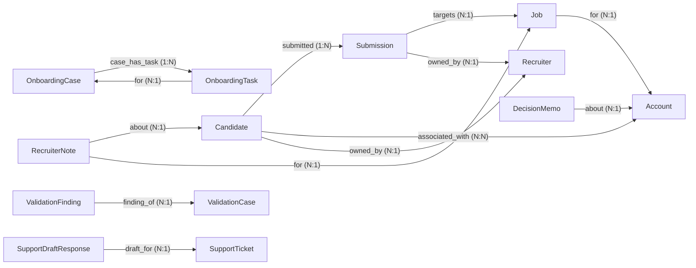
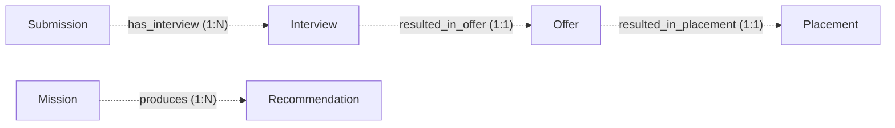
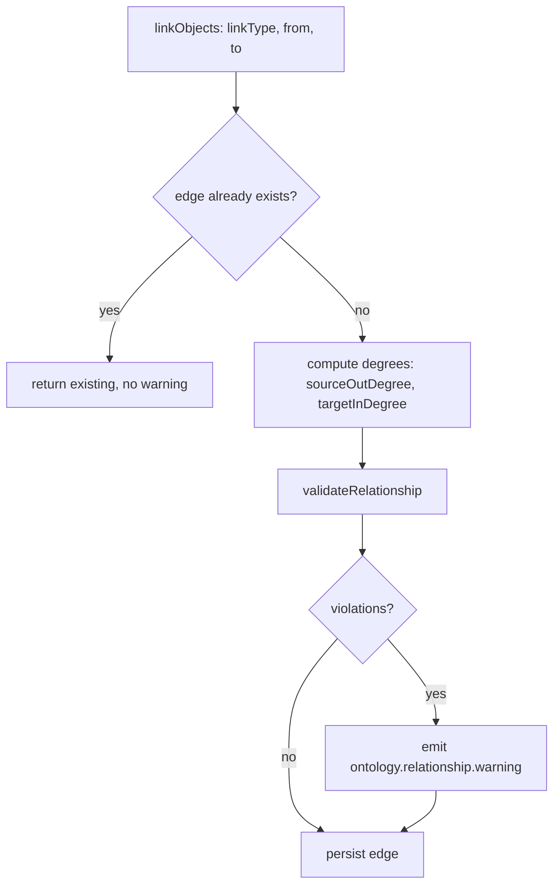

# Design Note — Canonical Relationship Model (ONT-002 / AS-005)

| Field | Value |
|-------|-------|
| Status | Implemented (warn-only) — VS-003 |
| Owner | LAWRENCE Architecture Council |
| Date | 2026-06-27 |
| Realizes | AS-005, ONT-002 |
| Related | ADR-0007; ONT-001; architecture/design/canonical-schema-registry.md |

> Companion to ONT-002. Records the design, the live graph, validation flow,
> migration implications (none), and future extension points. Warn-only and
> additive — no behavior change, no enforcement, no migration.

## 1. Rationale

ONT-001 governs canonical objects; their relationships were still free `linkType`
strings passed to `linkObjects`. VS-003 makes relationships first-class typed
contracts in a registry analogous to the object schema registry, validated
warn-only inside `linkObjects`. See ADR-0007 for the decision rationale.

## 2. Module layout

```
src/lib/dataops/ontology/relationships/
  types.ts        # RelationshipDefinition, cardinality/lifecycle enums, Violation
  definitions.ts  # seed RelationshipDefinition[] (active + planned/future-safe)
  registry.ts     # typed lookups: byId, byLinkType, findRelationship(triple)
  validate.ts     # pure: validateRelationshipShape, cardinalityViolations, validateRelationship
```

Integration: `object-service.linkObjects` calls a warn-only helper
(`warnOnRelationshipViolations`) after the idempotency check and before persist;
it emits `ontology.relationship.warning` on violation and never blocks.

## 3. The canonical graph (active relationships)



Planned (future-safe — declared only, endpoints NOT implemented):



## 4. Validation flow (warn-only)



`validateRelationship` is total (never throws); the emit is fail-open. The edge is
persisted in all cases.

## 5. Migration implications

**None.** This slice:

- adds new files only (the `relationships/` module, specs, ADR, tests);
- adds one additive call inside `linkObjects` (a best-effort warning emit);
- changes no schema, no table, no `OntologyLink`/`linkObjects` signature, no
  existing data. The live graph already validates clean (zero warnings across all
  pack installs + demos), so no backfill or data correction is required.

## 6. Future extension points

- **Enforcement mode** — reuse the ONT-001/ADR-0006 pattern: add a per-tenant/
  global `enforce` mode and a typed `RelationshipError`; reject illegal edges only
  when explicitly enabled. (Gated behind a future ADR + a zero baseline, which
  already holds.)
- **Validation hooks** — `RelationshipDefinition.validationHooks` is declared;
  wire it into `validateRelationship` for relationship-specific rules.
- **Emitted events / permissions** — currently declarative; a future slice can emit
  `ontology.relationship.created/removed` and enforce per-relationship permissions.
- **Inverse auto-materialization** — optionally create the inverse edge when one
  side is linked (today inverses are declared, not auto-created).
- **Promote endpoint types** — when Interview/Offer/Placement/Mission/Recommendation
  become canonical objects (ONT-00x), flip their relationships from `planned` to
  `active`; the contracts already exist.
- **Graph projections** — typed traversal helpers (e.g. `neighbors(obj, relId)`)
  built on the registry.
