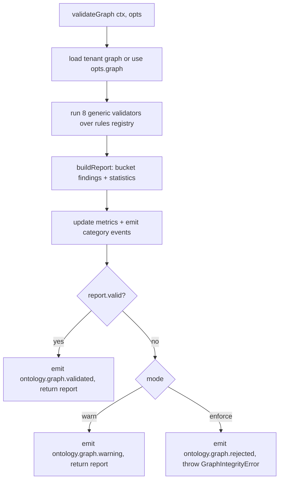

# Design Note — Enterprise Graph Integrity Engine (VS-005 / ADR-0009)

| Field | Value |
|-------|-------|
| Status | Implemented (warn-default, on-demand) — VS-005 |
| Owner | LAWRENCE Architecture Council |
| Date | 2026-06-27 |
| Realizes | ADR-0009 |
| Related | ONT-001 (ADR-0006), ONT-002 (AS-005 / ADR-0008), conformance-matrix.md |

> The engine answers "is this enterprise **graph** valid?" — above object and
> relationship validation. Deterministic, rule-driven, on-demand, warn by default.

## Module layout

```
src/lib/dataops/ontology/graph/
  graph-types.ts        # GraphRule, GraphFinding, GraphIntegrityReport, codes, mode
  graph-rules.ts        # configurable rules registry (the only place business rules live)
  graph-enforcement.ts  # warn|enforce resolution (tenant → global → env → default)
  graph-errors.ts       # GraphIntegrityError (carries the report)
  graph-report.ts       # pure report assembly + connected-components statistics
  graph-integrity.ts    # generic validators + validateGraph orchestrator + metrics + events
```

> **Path note.** The VS-005 brief named `src/lib/ontology/`. The repository's
> ontology governance already lives under `src/lib/dataops/ontology/` (`schemas/`,
> `relationships/`). To mirror the existing architecture rather than fragment it,
> the engine is co-located there under `graph/`.

## Validation categories → codes

| Category | Code | Driven by rule field |
|---|---|---|
| Required relationships | `GRAPH_REQUIRED_RELATIONSHIP` | `requiredRelationships[]` |
| Cardinality / multiplicity | `GRAPH_CARDINALITY` | `cardinality[]` (min/max), `uniqueRelationships` |
| Orphan detection | `GRAPH_ORPHAN` | `mustConnect` |
| Duplicate canonical edges | `GRAPH_DUPLICATE_EDGE` | global (same linkType+from+to) |
| Illegal shortcut paths | `GRAPH_INVALID_PATH` | `forbiddenParentTypes` / `forbiddenTargetTypes` |
| Cycles | `GRAPH_CYCLE` | global `cycleAllowedLinkTypes` allow-list |
| Reachability | `GRAPH_UNREACHABLE` | `reachability` |
| Policy preconditions | `GRAPH_POLICY` | `policies[]` (incl. `withStatus`) |
| (reserved) | `GRAPH_CONSTRAINT` | generic constraint extension |

Canonical-path validation (e.g. Placement must reach Candidate only through
Offer→Interview→Submission→Job, never directly) is expressed compositionally:
required-relationship to the immediate predecessor + `forbiddenParentTypes` for the
illegal shortcuts. No bespoke path validator, no hardcoded chains.

## Determinism

- Validators are pure functions of `(graph, rules, config)`.
- Findings are sorted by `(code, objectId, linkType, message)` before bucketing.
- Cycle detection iterates nodes/edges in sorted order and dedupes by canonical
  node-set. No randomness, no time-dependent branching (only the non-asserted
  `validationTimeMs` statistic reads the clock).

## Flow



## Migration implications

**None.** New files + one opt-off mode; the engine is on-demand and not wired into
any write path, so no existing flow invokes it. No schema, table, or data change.

## Future extension points

- **Wire into mission orchestration** as a precondition gate (VS-006+).
- **DB-persisted per-tenant graph mode** (today process-level, like objects/rels).
- **Incremental validation** (validate a subgraph touched by a workflow).
- **`GRAPH_CONSTRAINT` custom validators** via declared rule hooks.
- **Promote referenced types** (Resume/Interview/Offer/Placement/Mission/…) to
  canonical objects, flipping their rules from future-safe to live.
