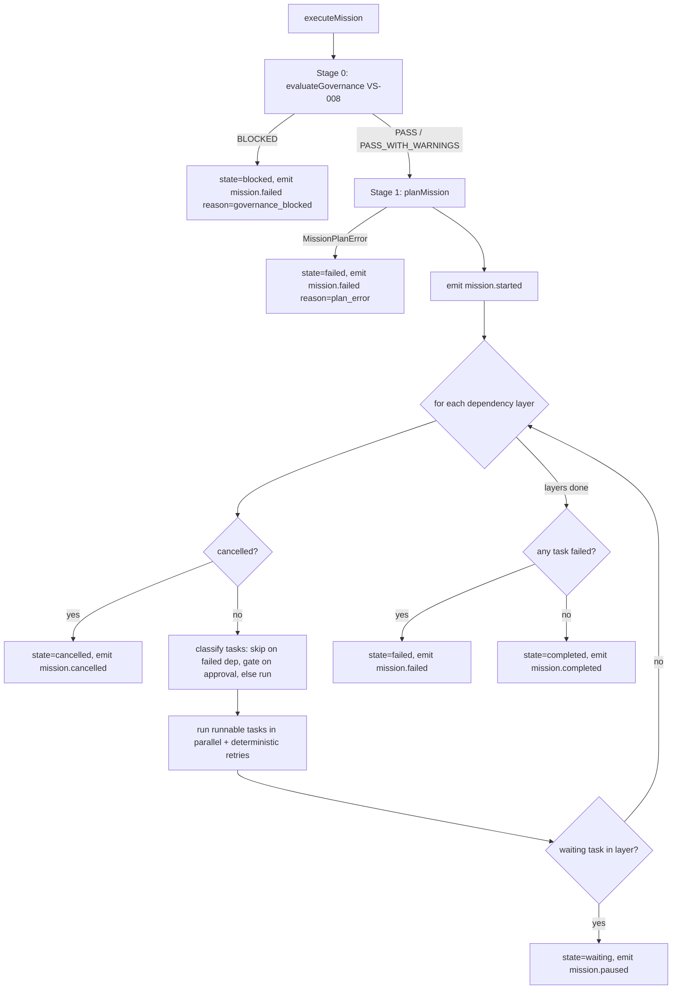

# Design Note — Mission Execution Runtime (MS-010 / ADR-0012)

| Field | Value |
|-------|-------|
| Status | Implemented (deterministic, on-demand) — MS-010 |
| Owner | LAWRENCE Architecture Council |
| Date | 2026-06-27 |
| Consumes | Governance Orchestrator (VS-008 / ADR-0010) |
| Related | ADR-0009 (graph), ADR-0006/0008 (object/relationship enforcement) |

> The canonical engine that executes enterprise missions after governance approval.
> Generic infrastructure only — no business/recruiting logic. Deterministic; no AI;
> no write-path changes (reads governance + emits audit events).

## Module layout

```
src/lib/missions/
  mission-types.ts        # MissionDefinition, TaskDefinition, states, report, events, options
  executor-registry.ts    # Agent Dispatcher: TaskExecutor interface + register/dispatch + lifecycle hooks
  execution-planner.ts    # Execution Planner + Dependency Resolver (layers, cycle/missing-dep detection)
  retry-manager.ts        # deterministic retry policy + runWithRetry
  mission-events.ts       # Event Publisher + Audit Recorder (typed runtime events)
  mission-runtime.ts      # MissionRuntime: executeMission() — Task Scheduler + State Manager + report
```

Component → file mapping (architecture diagram):

| Component | Where |
|-----------|-------|
| Execution Planner / Dependency Resolver | `execution-planner.ts` |
| Task Scheduler | layer loop in `mission-runtime.ts` |
| Agent Dispatcher | `executor-registry.ts` (+ dispatch in `mission-runtime.ts`) |
| Human Approval Gate | approval handling in `mission-runtime.ts` |
| Retry Manager | `retry-manager.ts` |
| Event Publisher / Audit Recorder | `mission-events.ts` |
| Mission State Manager | state transitions + report in `mission-runtime.ts` |

## Execution flow



## Determinism

- Planner uses Kahn layering with **sorted** selection → stable layers/order.
- Within a layer, `mission.task.started` events are emitted in sorted order, tasks
  run via `Promise.all`, and results are applied in **sorted** order — so the event
  sequence and report are reproducible regardless of async timing.
- Retries are fixed-count, no backoff. Only `durationMs` reads the clock (a
  non-asserted statistic).

## Human approval model (pause/resume)

Approval is an **execution gate**, not persisted cross-call state. A task with
`requiresApproval` that is not in `opts.approvals` becomes `waiting`; the runtime
runs the rest of that layer, then **pauses** (mission `waiting`, `mission.paused`).
Re-invoking with the approval granted proceeds. Persisted, resumable execution
state (so completed tasks are not re-run on resume) is future work.

## Failure propagation

A task that exhausts its retries is `failed`; its transitive dependents are
`skipped`; independent branches still run; the mission ends `failed`.

## Migration implications

**None.** New module + tests + docs. No schema, table, data, write-path, or
existing-behavior change. Concrete executors and any execution wiring are additive
follow-ups.

## Delivered follow-ups

- **Governed Action Executor (MS-011 / ADR-0013)** — `executors/action-executor.ts`
  (key `mission.action`) bridges a task to the Mission Control action engine via
  `executeAction()`, reusing its governed pipeline. Self-registers via the platform
  bootstrap. Task input: `{ actionKey, actionInput?, object?, approvalExempt? }`.
- **Durable Mission Executions (MS-011 / ADR-0013)** — `mission-execution-store.ts`
  + the `missionExecutions` collection persist every report at every exit path;
  read via `getMissionExecution` / `listMissionExecutions`.

## Future extension points

- **Domain-specific executors** registered by domain packs (Agent Dispatcher).
- **Persisted/resumable execution state** (true pause/resume without re-running
  completed tasks; today executions are persisted as terminal records).
- **Mission-task handling of an action's own approval gate** (today surfaced
  fail-closed).
- **Workflow Runtime** reusing the planner/scheduler/dispatcher/governance shape.
- **Approval / mission-execution UI** over the Waiting state + persisted records.
